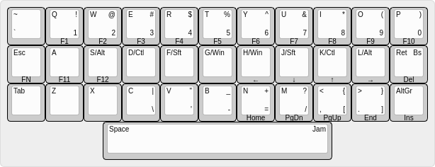

# SpaceJam 34-key Layout

This is a crazy small layout based on space as a multi-purpose key.

The home-row keys act as the alphanumeric characters they represent if tapped
and as the modifier keys if held. The esc key also works as an additional FN
key if held.

This Kmonad layout is actually my 'test-drive' for the project of actually
building this keyboard. If anyone is crazy enough to test this I'd appreciate
any feedback.
